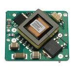
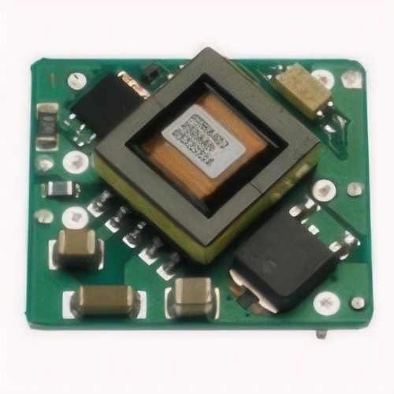
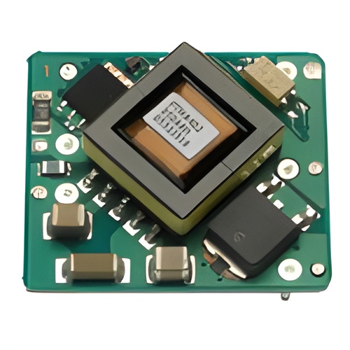
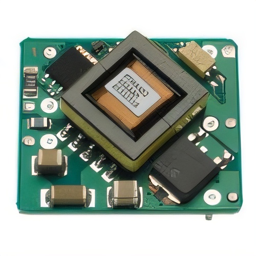

# image-upscaler-tools

A modular, composable Python toolkit for professional **image denoising** (11 methods) and **super-resolution upscaling** (7 engines).

Built for high-throughput e-commerce catalogs, industrial image pipelines, and research restoration tasks. Mix and match any denoiser before or after any upscaler using an intuitive fluent pipeline API.

[](https://www.python.org/)
[](https://opensource.org/licenses/MIT)
[](https://github.com/HamdEmad/image-upscaler-tools)

---

## Visual Comparison (150x150 Native -> 500x500 Output)

| Original Native (150x150) | PIL Lanczos (500x500) | SPAN 4x (500x500) |
| :---: | :---: | :---: |
|  |  |  |
| **Real-ESRGAN (500x500)** | **4x-UltraSharp (500x500)** | **Pre-Denoised HAT (500x500)** |
|  |  |  |

---

## Key Capabilities

- **11 Denoising Algorithms**: From real-time spatial filters (`fast_nlm`, `bilateral`, `adaptive_median`, `median`, `gaussian`, `mean`) to transform-domain methods (`wavelet`, `tv_chambolle`, `skimage_nlm`) and deep blind neural denoising (`scunet`).
- **7 Super-Resolution Engines**: Parameter-free attention (`span`), hybrid transformers (`hat`), GAN & PSNR models (`realesrgan`, `realesrnet`, `ultrasharp`), OpenCV CPU graph (`edsr`), and classical interpolation (`pil`).
- **Composable Pipeline (`ImagePipeline`)**: Execution order strictly equals call order. Run denoise-only, upscale-only, denoise-then-upscale, upscale-then-denoise, or arbitrary chains.
- **Tiled Neural Inference**: Process multi-megapixel images seamlessly on CPU or consumer GPUs with feathered blending (`--tile 256`).
- **Aspect Ratio Control**: `fit="stretch"`, `fit="contain"` (padded canvas), or `fit="cover"` (centered crop).
- **Automated Checkpoint Verification**: Automatic discovery and SHA-256 integrity verification with clear manual fallback instructions (see [MODELS.md](MODELS.md)).

---

## Installation

### 1. Install Directly from GitHub via Pip

```bash
pip install git+https://github.com/HamdEmad/image-upscaler-tools.git
```

### 2. Install from Local Source (Editable Development)

```bash
git clone https://github.com/HamdEmad/image-upscaler-tools.git
cd image-upscaler-tools
pip install -e .
```

*With optional acceleration (for accelerated Adaptive Median filtering via Numba):*
```bash
pip install -e ".[fast]"
```

---

## Quickstart

### 1. Primary API: Composable `ImagePipeline` (Call Order = Execution Order)

```python
from image_upscaler_tools import ImagePipeline, get_denoiser, get_upscaler

# Mix: Clean noise -> Super-resolve 4x -> Smooth residual artifacts
pipeline = ImagePipeline()
pipeline.add("fast_nlm", h=3)
pipeline.add("hat")
pipeline.add("bilateral", d=5)

output = pipeline.run("product.jpg", target_size=(500, 500), fit="stretch")
output.save("enhanced_500.jpg")

# Inspect execution timings per stage
print(pipeline.last_timings)
# [('fast_nlm', 0.16s), ('hat', 22.4s), ('bilateral', 0.02s)]
```

#### Denoise Only (Resolution strictly preserved)
```python
ImagePipeline().add("median", ksize=3).run("raw.jpg", save="clean.jpg")
```

#### Upscale Only
```python
ImagePipeline().add("span").run("small.jpg", target_size=(500, 500), save="large.jpg")
```

#### Reverse Order: Upscale first, then denoise
```python
ImagePipeline().add("span").add("bilateral", d=5).run("raw.jpg")
```

---

### 2. Functional One-Liner: `process_image`

```python
from image_upscaler_tools import process_image

# Pre-configured named recipe
process_image("raw.jpg", preset="catalog_fast", target_size=(500, 500), save="out.jpg")

# Concise step-string syntax
process_image("raw.jpg", steps="fast_nlm(h=3) > span", target_size=(500, 500))

# Explicit two-stage configuration
process_image(
    "raw.jpg",
    denoiser="fast_nlm",
    upscaler="span",
    order="denoise_first",
    target_size=(500, 500),
    denoiser_params={"h": 3}
)
```

---

## Engine & Filter Inventory

### Denoisers (11 Keys)

| Key | Implementation | Key Parameters | Best Used For |
| :--- | :--- | :--- | :--- |
| `fast_nlm` | `cv2.fastNlMeansDenoisingColored` | `h=3.0, h_color=3.0` | **E-commerce JPEG cleanup**, white-background noise |
| `bilateral` | `cv2.bilateralFilter` | `d=5, sigma_color=30, sigma_space=30` | Edge-preserving smoothing |
| `skimage_bilateral` | `skimage.restoration.denoise_bilateral` | `sigma_color=0.03, sigma_spatial=5` | Gentle pre-filter before neural transformers |
| `adaptive_median`| Custom vectorized AMF | `s_max=7` | **Dense salt-and-pepper noise**, dust, sensor defects |
| `median` | `cv2.medianBlur` | `ksize=3` (odd integer) | Fast impulse noise removal |
| `gaussian` | `cv2.GaussianBlur` | `sigma=0.8, ksize=0` | General soft blur and high-frequency suppression |
| `mean` | `cv2.blur` | `ksize=3` | Uniform spatial box averaging |
| `tv_chambolle` | `skimage.restoration.denoise_tv_chambolle` | `weight=0.05` | Cartoon / graphic total variation minimization |
| `wavelet` | `skimage.restoration.denoise_wavelet` | `method="BayesShrink", mode="soft"` | Multiscale frequency thresholding |
| `skimage_nlm` | `skimage.restoration.denoise_nl_means` | `patch_size=7, patch_distance=11, h=0.1` | Rigorous statistical Non-Local Means |
| `scunet` | Neural Swin-Conv-UNet | `tile=256` | Complex mixed real camera sensor noise |

### Super-Resolution Upscalers (7 Engines)

| Key | Model Architecture | Native Scale | License | Commercial Use | Speed (CPU) |
| :--- | :--- | :---: | :--- | :---: | :---: |
| `span` | Swift Parameter-free Attention | 4x | Apache 2.0 | **Yes** | **~0.15s (Sub-second)** |
| `hat` | Hybrid Attention Transformer | 4x | CC BY-NC-SA 4.0 | Non-Commercial | ~25.0s (Highest Detail) |
| `realesrgan` | Real-ESRGAN (RRDBNet) | 4x | BSD 3-Clause | **Yes** | ~8.5s |
| `realesrnet` | Real-ESRNet (Non-GAN) | 4x | BSD 3-Clause | **Yes** | ~8.5s |
| `ultrasharp` | 4x-UltraSharp ESRGAN | 4x | Community | Non-Commercial | ~8.5s (Sharp Text) |
| `edsr` | EDSR (OpenCV dnn_superres) | 4x | BSD 3-Clause | **Yes** | ~1.5s |
| `pil` | PIL Lanczos Resampling | Any | MIT | **Yes** | Instant |

*For complete licensing terms, model author credits, and SHA-256 checksums, see [MODELS.md](MODELS.md).*

---

## Production Presets

| Preset | Stages | Intent & Recommended Scenario |
| :--- | :--- | :--- |
| `catalog_fast` | `fast_nlm(h=3) > span` | **High-volume batch pipelines**. Sub-second, clean JPEG artifacts, sharp borders. |
| `catalog_premium` | `fast_nlm(h=3) > hat` | **Hero product photos**. Best structural clarity and texture fidelity. |
| `restore_heavy` | `scunet > hat` | Severely degraded, compressed, or noisy supplier photography. |
| `gentle_bilateral_hat`| `skimage_bilateral > hat` | Edge-safe pre-smoothing before Transformer super-resolution. |
| `impulse_clean_fast` | `adaptive_median > span` | Dust particles and dead pixel removal followed by fast 4x upscaling. |

---

## Command Line Interface (CLI)

The package provides two equivalent executable commands: `image-upscaler` and `upscale`, as well as `python -m image_upscaler_tools`.

```bash
# 1. Denoise only
image-upscaler raw.jpg --denoiser fast_nlm -o clean.jpg

# 2. Upscale only
image-upscaler raw.jpg --upscaler span --size 500 500 -o upscaled_500.jpg

# 3. Denoise then Upscale
image-upscaler raw.jpg --denoiser fast_nlm --upscaler span --order denoise_first --size 500 500

# 4. Upscale then Denoise
image-upscaler raw.jpg --upscaler hat --denoiser bilateral --order upscale_first --size 500 500

# 5. Using named presets
image-upscaler raw.jpg --preset catalog_fast --size 500 500

# 6. Arbitrary step chain
image-upscaler raw.jpg --steps "fast_nlm(h=3) > span > bilateral(d=5)" --size 500 500

# 7. Batch directory processing (models load once and are reused)
image-upscaler ./raw_images/ --preset catalog_fast --size 500 500 -o ./processed/

# 8. Memory-constrained environments (Tiling)
image-upscaler large_image.jpg --upscaler hat --tile 256 --tile-overlap 16

# 9. Discovery & Inspection
image-upscaler --list-all
image-upscaler --describe span
```

---

## Aspect Ratio Fit Policies

When specifying a `--size WIDTH HEIGHT` (or `target_size=(W, H)` in Python) that does not match the input aspect ratio:

- `fit="stretch"` *(default)*: Resizes directly to `(W, H)` using Lanczos resampling.
- `fit="contain"`: Preserves input aspect ratio, fits within target dimensions, and pads the remaining space (transparent canvas for RGBA, white canvas for RGB).
- `fit="cover"`: Preserves aspect ratio, fills target dimensions, and crops the center.

---

## Testing

Run the automated test suite with pytest:

```bash
python -m pytest -v
```

All 38 test cases validate dtype preservation, alpha channel integrity, parameter bounds, impulse noise removal, step string parsing, and neural inference.

---

## License

This repository and its codebase are released under the [MIT License](LICENSE). Checkpoints and model weights carry their respective licenses documented in [MODELS.md](MODELS.md).
